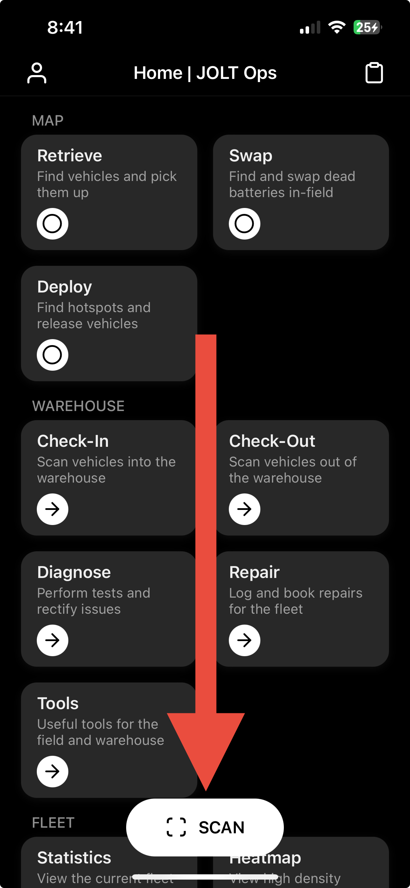

# Collecting Vehicles

Collecting vehicles unlocks them and removes them from the rider map in events such as charging, repairs or rebalancing.

## Finding Vehicles to Collect

<figure><figcaption>
Map - Retrieve Screen
</figcaption></figure>

In the Retrieve screen, you will see a map of all vehicles within an area. Each status is colour coded so you can quickly differenciate available vehicles from unavailable ones. Additionally, vehicles will tasks will have a badge containing a number at the top right of the vehicle pin. The number inside of it shows the priority, so please start collecting the higher priority tasks first.

**Status Colour Key**:\
Green: Available\
Red: Unavailable\
Blue: Reserved or In Ride by customer\
Yellow: Collected by operator or charger\
Black: Checked-In & Warehoused\
Grey: Other

## **Home Screen**

1. Press the pill-shaped 'SCAN' button at the bottom of the screen.

<figure><figcaption>
Home Screen
</figcaption></figure>

2. Change the mode to 'Collect'.

<figure><figcaption>
Scan Screen
</figcaption></figure>

3. Scan the vehicle! You will receive a confirmation once it has been collected successfully.

<figure><figcaption></figcaption></figure>

## Map Screen

**Remote Unlocking**

When you're within range of a vehicle, you can unlock it remotely by pressing the 'Collect' button inside its info window. Make sure you're within eyesight of the vehicle when doing this.

<figure><figcaption></figcaption></figure>

