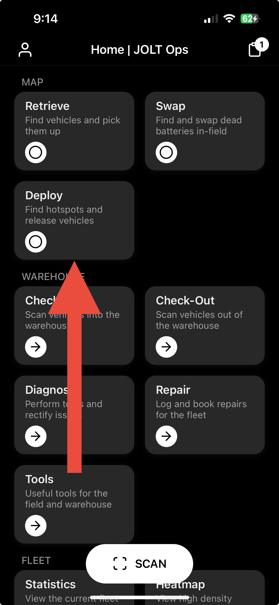
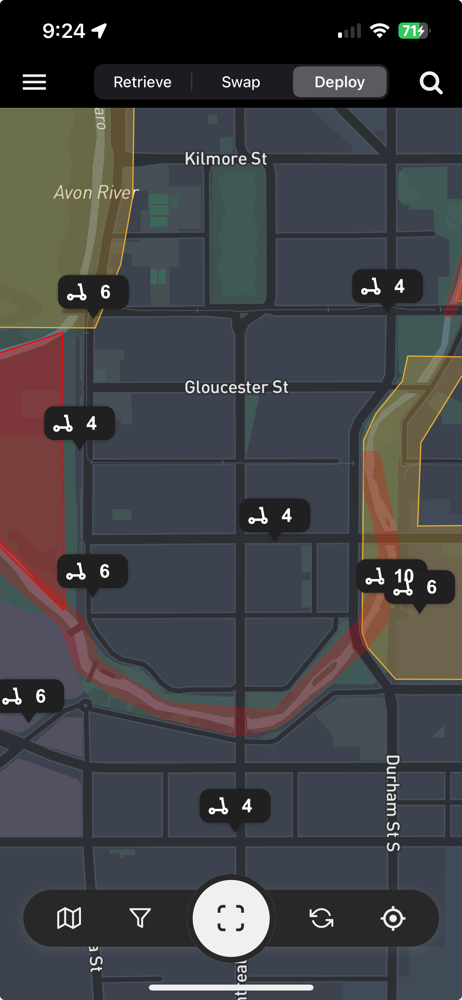
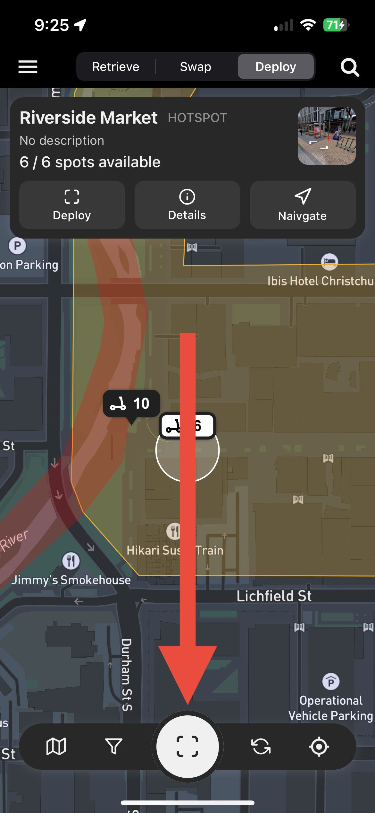
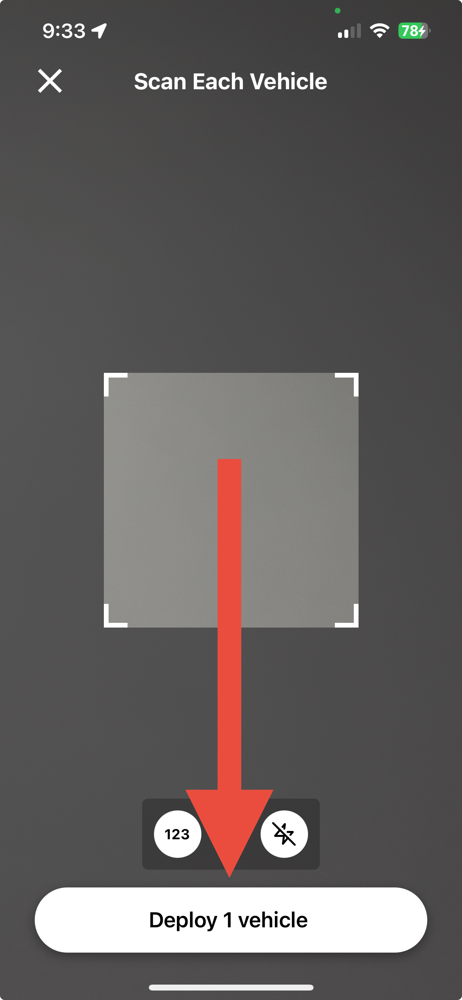
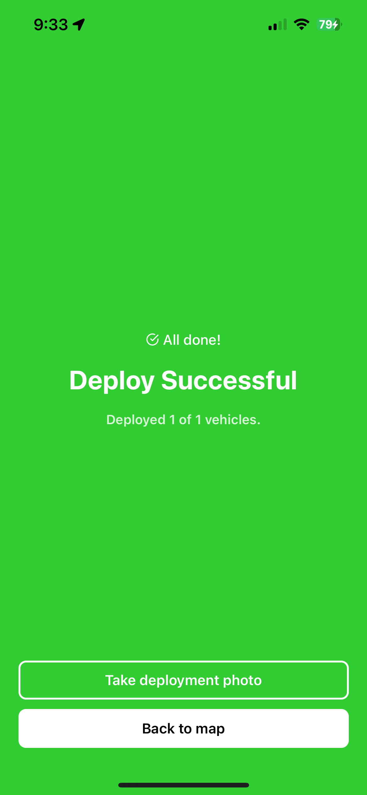

# Deploying Vehicles

Deploying vehicles locks them, displays them on the rider map, and makes them available for hire by riders. The JOLT Ops app streamlines this process and makes vehicle deployment very quick.

**Deployment Guidelines**:

* Vehicles must be spaced far enough apart to ensure a rider can easily hire a scooter in the middle.
* Vehicle handlebars must all be facing in the same direction (preferably to the left).
* Vehicles must not be blocking any accessways or footpaths.

## Deployment Process

1. Press the 'Deploy' tile in the Home Screen OR toggle to Deploy mode from within the Map screen.

<figure><figcaption></figcaption></figure>

2. A map showing hotspots will appear. Hotspots are placed in locations where there is high demand for vehicles. The number inside the hotspot pin shows the amount of free spaces each hotspot has. In some markets, vehicles must be deployed at hotspots, but for the rest; hotspots can be used as a reference to where vehicles should be deployed. You can tap on a hotspot to view more information about it.

<figure><figcaption></figcaption></figure>

3. Tap the scan button in the centre of the dock at the bottom. This will present the deployment scanner.

<figure><figcaption></figcaption></figure>

4. Scan each vehicle you wish to deploy, then press the 'Deploy x vehicle(s)' button at the bottom.

<figure><figcaption></figcaption></figure>

5. The deployment process will start, and you will receive a summary of the deployment, including any issues. Some markets may require a photo of the vehicles you are deploying. If so, please stand back and ensure all vehicles are within the frame and there is padding on all sides of the photo. If the app does not ask for a photo before deployment, you will have the option to take one after the deployment process is completed.

<figure><figcaption></figcaption></figure>

