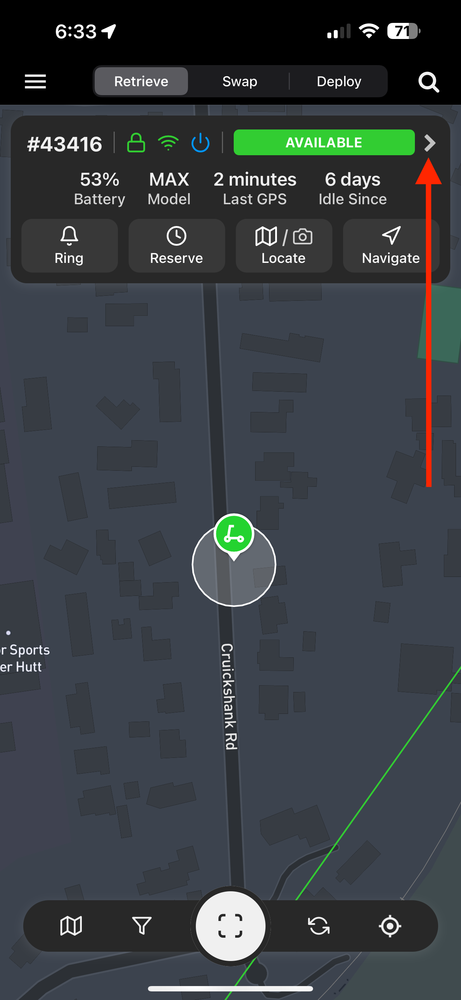
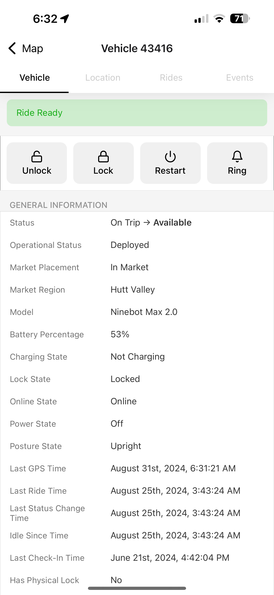

# Understanding the vehicle page

When using the JOLT Operator app you can click on a vehicle and view its information.

### Quick View

Start by locating a vehicle and tapping on it to bring up its info window.

<figure><figcaption>
Vehicle Info Popup
</figcaption></figure>

The fields will populate with the vehicle information, starting with the vehicle ID which starts with a #, followed by the scooter status: locked (Green) or Unlocked (Blue), Connectivity with the server, Online (Green) or Red (Offline), and Scooter Power Status, On (Green) or Off (Blue). \
\
The top right shows the status of the vehicle. If applicable you can tap on it to perform actions. For example, if the status is 'Available', you can tap on it to disable the vehicle and vice versa.\
\
The middle section indicates scooter statistics starting with Battery Percentage, Model of the scooter, Last GPS signal sent to the server and how long the scooter has been sitting idle from its last ride.\
\
If a scooter has outstanding issues it will be displayed between the middle section and the quick select buttons such as "Tipped Over" or Error codes.

Lastly, the quick select buttons on the bottom are used when locating and collecting a scooter.\
"Ring" will ring the scooter's loud alarm to help locate it. "Reserve" will make the scooter unavailable and show other operators you are en route to this vehicle, it will also prevent other operators from collecting it when it's reserved for you. "Locate" will allow you to view the last locations of a scooter and the end ride photo you can also start navigation from this screen.

### Viewing detailed scooter information

Tap the right arrow on the quick view menu to view detailed scooter information.

<figure><figcaption>
Navigating to detailed vehicle screen
</figcaption></figure>

Once you have entered the vehicle page, you'll see in-depth information about the vehicle.

<figure><figcaption>
Detailed Vehicle Screen
</figcaption></figure>

Starting at the top the screen will display the scooter ID followed by the subsection. There are 4 subsections you can navigate through. 'Vehicle', 'Location', 'Rides' and 'Events'. Note: Some features may not be available depending on your access level.\
\
At the top of the page, you may see badges containing information about the vehicle depending on its current state. Each badge contains important information about the vehicle. E.g. 'Ride Ready' to tell you that the vehicle is currently available for hire by a customer, or '\[OPERATOR] Picked up by John Doe' to tell you that it is currently being handled by an operator.\
\
There are 4 quick select buttons, "Unlock", "Lock", "Restart" and "Ring". These buttons are used the most and therefore are prioritised at the top. These can change based on the model of the vehicle.

Note: If the vehicle is offline, not all data will be up-to-date and therefore may not be correct.\
\
Heading down the list is the vehicle's general information:\
\
**Vehicle**\
"Status" - Displays the current and previous status of the vehicle. \
"Operational Status" - Provides a more detailed status of the vehicle, used to determine its next action (e.g., 'Needs Inspection' or 'Checked-In - Deploy').\
"Market Placement" - Indicates whether the vehicle has been deployed.\
"Market Region" - The region to which the vehicle is assigned.\
"Model" - The vehicle's model.\
"Battery Percentage" - Current battery level of the vehicle.\
"Charging State" - Indicates if the scooter is currently charging.\
"Lock State" - The lock status of the scooter.\
"Online State" - Indicates the connection status with JOLT's server.\
"Power State" - The vehicle's power status (if 'Off'; the vehicle is in low power mode).\
"Posture State" - Indicates whether the vehicle is upright or has tipped over.\
"Last GPS Time" - Timestamp of the latest GPS location sent by the IoT.\
"Last Ride Time" - Timestamp of the last trip's end.\
"Last Status Change" - Timestamp of the last update to the 'Status' property.\
"Last Check-In Time" - Timestamp of the vehicle's last check-in at a warehouse.\
"Has Physical Lock" - Indicates if the vehicle has a physical lock, such as a helmet lock.\
"Physical Lock Type" - Specifies the type of physical lock (e.g., helmet or cable lock).\
"Serial Number" - The serial number of the vehicle chassis.\
"Battery Serial" - The serial number of the last recorded battery.\
"External Battery Serial" - If applicable, the serial number of the external battery.\
"Undeployable" - Indicates if the vehicle has any issues preventing deployment.\
"Damaged" - Indicates if the vehicle has been flagged as damaged, either manually or automatically.\
"Lost" - Indicates if the vehicle has been flagged as missing.\
"Error Code" - The current error code reported by the vehicle, and if available; the definition of it.\
"Photo" - The last photo taken by a customer or operator, if available.\
\
**Task Information**\
"Name" - Displays the task name.\
"Description" - Displays a short description of the task.\
"Priority" - Indicates the priority level of the task.\
"Time/Date" - Timestamp of when the task was issued.\
"Charger" - If applicable, displays the task type and payout for contractors.\
\
**Upgrade Information**\
"Status" - Current status of the upgrade.\
"Progress" - Percentage of the progress of the update.\
"Component" - The component that is upgrading.\
"Previous Firmware" - The previous firmware version.\
"New Firmware" - The firmware version that is being installed.\
\
**IoT Information**\
**"**Firmware Version" - The firmware version that is currently installed on the IoT.\
"Connection State" - Indicates the connection status with JOLT's server (this is current - unlike Online State which has a 10-minute timeout before reflecting offline)\
"IMEI" - Unique Identifier for IoT - this is attached to the back of the IoT.\
"Bluetooth Key" - The unique password for the IoT. Note: This changes frequently.\
"Mac Address" - The MAC Address for the IoT - this is usually attached on the side of the IoT.\
"Estimated Battery" - The estimated battery for the backup battery inside of the IoT.\
"Signal Strength" - The signal strength of the IoT's 4G connection.\
"Satellites" - Indicates the number of satellites the IoT is currently connected to.\
"Last Contact Time" - Timestamp of the IoT's last check-in to JOLT's server.\
"Sign In Time" - Timestamp of when the IoT last opened a connection to JOLT's server.\
"Sign Out Time" - Timestamp of when the IoT disconnected from JOLT's server.\
\
**Firmware Information**\
"IoT Version" - The firmware version that is currently installed on the IoT.\
"Controller Version" - The firmware version that is currently installed on the controller.\
"Dashboard Version" - The firmware version that is currently installed on the dashboard.\
"Internal Battery Version" - The firmware version that is currently installed on the battery.\
"External Battery Version" - If applicable, the firmware version that is currently installed on the external battery.

\
\
The next section is dedicated to IoT commands that you're able to control the scooter with.&#x20;

**IOT Commands\***\
"Light Off" - Turns off the headlight for the vehicle.\
"Light On" - Turns on the headlight for the vehicle.\
"Restart" - Restarts the IoT device.\
"Helmet" - Unlocks the helmet lock on the vehicle.\
"Power Off" - Ability to power off just the scooter and IoT\*\*.\
"Power On" - Powers on the vehicle only.\
"IOT Sounds Off" - Disables all IoT sounds.\
"IOT Sounds On" - Enables all IoT sounds.

More commands may be available for your account and are labelled under the "More Commands" button.\
\
The last section is dedicated to status commands for the vehicle where you can control the market availability.\
\
"Pickup" - Unlocks and collects the scooter for the operator.\
"Deploy" - Locks and sets the vehicle to available.\
"Disable" - Disables the vehicle from being scanned and removes it from the rider map.\
"Enable" - Enables the vehicle for riders to use.\
"Check In" - Checks the vehicle into the warehouse for maintenance or storage.\
"Check Out" - Checks the vehicle out of the warehouse ready for deployment.\*\*\*

_\* Your role may not have access to view or access certain information._\
\
_\*\*Please note: Powering down the IoT device will require the vehicle to be plugged into a charger to power it back on, this feature is only designed for long-term storage or warehouse-to-warehouse transportation._\
\
_\*\*\* Vehicles will need to be checked out of the warehouse before they can be deployed._
